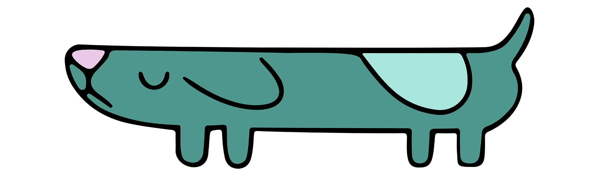
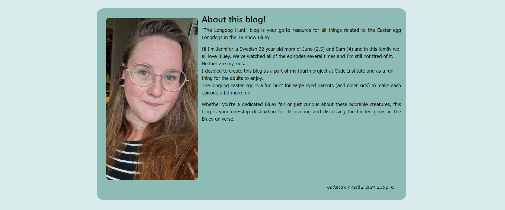
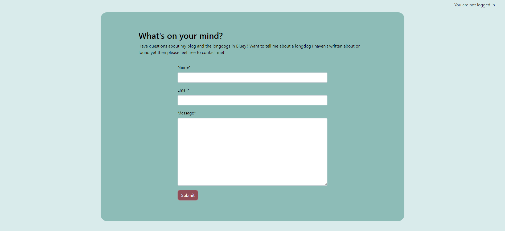

# The Longdog Hunt

The Longdog Hunt is a simple blog based on the kids tv show Bluey and the easter eggs in the show called Longdogs that is hidden in plain sight in pretty much every episode.

[**Live site**](https://the-longdog-hunt-9f116eb214b4.herokuapp.com/)


## Features

<a name="navbar"></a>
### __Navbar__

__Fully responsive navbar with links to:__

    - Home page
    - About page
    - Register section
    - Login section
    - Contact Section
    - Likes (If user is autenticated)

__Logo hyperlinked to home page:__


Featured on all pages across the site.

The navbar will adapt to if user is authenticated or not (When logged in Login and Register will be hidden and Logout will be displayed in the navbar.)

__Navbar for non-authenticated users__:


__Navbar for authenticated users__:


___Purpose of feature:___
Provide users with an easy and straight-forward way to navigate the site

<a name="footer"></a>
### __Footer__

Featured on all pages across the site.
The footer contains links to my personal GitHub, Instagram and Facebook.


___Purpose of feature:___
Provide users with a way to connect with me and check out my GitHub profile and social media accounts.

<a name="home-page"></a>
### __Home page__

__The Home page consists of:__

    - Blog Section


__Blog Section__

The Blog Section features the blogposts created by the author and will be displayed the same no matter if the user is logged in or not.


___Purpose of feature:___
Provide users with a welcoming landing page that is straight forward and clear for the user what the website is all about.


<a name="about-page"></a>
### __About page__

__The About page consists of:__

    - A profile picture of the blog admin
    - About section



__Profile picture__

The About page displays an image of the admin next to the paragraph section.

___Purpose of feature:___
Provide users with some insight of who the admin is.

__About Section__

Gives a description of the blog and its content and gives a small presentation of who the admin is.

___Purpose of feature:___
Provide users with information about the blog and a description of the admin.

<a name="contact-page"></a>
### __Contact Page__



__The Contact page consists of:__

    - Contact Form

__Contact form__

The contact form gives the user a way to contact the admin of the blog if they have any questions etc.

The fields the user needs to fill in is:

- Name
- Email
- Message

_Additional_: All of the fields are required to be filled in, if it's not the user will be prompted to fill in the field before sending. 
The email field needs to contain an email with @ in it to be sent.

___Purpose of feature:___
Provide users with a way to contact the admin and creator of the site.

<a name="login-page"></a>
### __Login page__


__The Login page consists of:__

    - Login form

__Login form__

The login form allows the user to enter their credentials and authenticate to enter the sites authenticated state.

The login form also contains a link to the [Register page](https://the-longdog-hunt-9f116eb214b4.herokuapp.com/accounts/signup/) in case the user is not already registered.

___Purpose of feature:___
Provide users with a way to login to the site.

<a name="register-page"></a>
### __Register page__


__The Register page consists of:__

    - Sign up form

__Sign up form__

The Sign up form which is provided by django allows the user to enter credentials for registration on the site.

Through django it contains all the functionality for a secure registration and displays help text and error text to give the user feedback

The sign up form also contains a link to the [Login page](https://the-longdog-hunt-9f116eb214b4.herokuapp.com/accounts/login/) in case the user already has an account.

___Purpose of feature:___
Provide users with a way to register an account on the site.

<a name="Blogpost-page"></a>
### __Blogpost page__


__The Blogpost page consists of:__

    - A view of the blogpost
    - A commentfield under the blogpost

The Blogpost page displays the Title of the blogpost, the author, a time and date when the blogpost was created, possible images in the blogpost and the text content.

Below the blogpost there's a comment field and a textfield for a logged in user to write a comment in. If the user isn't logged in they can't comment and are prompted to login first along with links to the login page.

___Purpose of feature:___
Provide users with a way to see the specific blogposts and give logged in users a way to interact with the writer and share their opinion of the blogpost through comments.


__Like button__


The like button, placed on the left end of the screen right above the comment section, allows users to like or unlike a post.

The liked posts are then stored in the Likes page where the authenticated user can navigate to display all their liked posts.

_Additional_: The like button adapts to if the user is authenticated or not. If the user is not authenticated the like button is disabled.


___Purpose of feature:___
Provide users with a way to to like posts they find interesting.

__Comment section__


The comment section allows users to post comments on a post aswell as delete and edit their comment using the buttons displayed below the users comments.

_Additional_: The delete button displays a modal requiring the user to confirm deletion of the comment.


## Testing

__Manual testing__

The website has been manually tested and everything has been documented in the testing.md file.

Click here to go to: [Testing and validation](testing.md)


## Validators

All validation can be found in the testing.md file.

Click here to go to: [Testing and validation](testing.md)


## Deployment

This project was deployed to Heroku using these steps:

    1. Fork or clone this repository
    2. Create a new Heroku app
    3. Set the buildpacks to Python
    4. Set the config vars for your database connection and api keys
    4. Link the Heroku app to the repository
    5. Click on deploy

## Run Locally

Clone the project

```bash
  git clone https://github.com/linx02/project-hub.git
```

Go to the project directory

```bash
  cd project_hub
```

Install dependencies

```bash
  pip3 install -r requirements.txt
```

Start the server

```bash
  python3 manage.py runserver
```

Note that you will have to setup your own database and API connections using these steps:

1. Create a file name "env.py" in the projects root directory.
2. Copy and paste this code in the env.py file and replace values with your own:

```python
import os

os.environ["DATABASE_URL"]=YOUR_DATABASE_URL
os.environ["SECRET_KEY"]=YOUR_SECRET_KEY
os.environ["CLOUDINARY_SECRET"]=YOUR_CLOUDINARY_SECRET
os.environ["THUMIO_AUTH"]=YOUR_THUMIO_AUTH_KEY
```

## Wireframes (Balsamiq)
I created the wireframes for this site with Balsamiq. All wireframes can be found in the folder called [Wireframes](https://github.com/gStarhigh/pro2/tree/main/documentation/wireframes).
The wireframes should not be considered finished product, but as a tool I used as inspiration when creating the Quiz.

<details>
<summary><b>Wireframes for desktop</b></summary>
<summary>Index</summary>

<summary>About</summary>

<summary>Contact</summary>

<summary>Sign up</summary>

<summary>Sign in</summary>

</details>

<details>
<summary><b>Wireframes for mobile</b></summary>
<summary>Index</summary>

<summary>About</summary>

<summary>Contact</summary>

<summary>Sign up</summary>

<summary>Sign in</summary>

</details>


## Database schema and Flowchart


__Data storing__:

[PostgreSQL](https://www.postgresql.org/): Database management system used.

[Cloudinary](https://cloudinary.com/): For storing image files in the cloud.


## Credits
__Media__:

- Longdog png image:
https://svgdeal.com/?s=Bluey

- Images with longdogs in them from:
1. https://www.abc.net.au/news/2023-10-24/hidden-easter-eggs-bluey-long-dog/102820826
2. https://blueypedia.fandom.com/wiki/Long_Dog_Easter_Egg
3. https://www.news.com.au/entertainment/tv/bluey-background-artist-reveals-easter-eggs-hidden-in-episodes/news-story/c8b7be2900d4a937b644682cb2139b01 (news.com source for images: Facebook, Adult Bluey Fans)
[Haikei](https://haikei.app/): For background svg on the [home page](#home-page).

- [Youtube video](https://www.youtube.com/watch?v=xqFM6ykQEwo): I used this video to get me going at the start.

__Other Credits__:

- The blog is based on CI I think therefore I blog that I have adapted to fit my own project.

- Thanks to the slack community for help and somewhere to vent when thing get hard.

- A big thank you to my mentor [Gareth McGirr](https://github.com/Gareth-McGirr/) for the continuing support in all my projects.