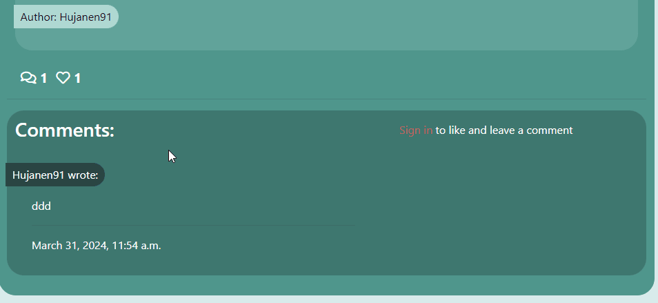
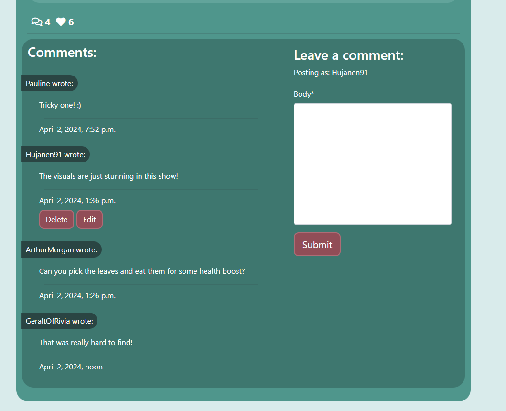

# The Longdog Hunt

The Longdog Hunt is a simple blog based on the kids tv show Bluey and the easter eggs in the show called Longdogs that is hidden in plain sight in pretty much every episode.

[**Live site**](https://the-longdog-hunt-9f116eb214b4.herokuapp.com/)


# Content

- [Project Goals](#project-goals)
  - [User Goals](#user-goals)
  - [Site Owner Goals](#site-owner-goals)
  - [User Stories](#user-stories)
  - [Agile Planning](#agile-planning)
- [Features](#features)
  - [Navbar](#navbar)
  - [Footer](#footer)
  - [Home page](#home-page)
  - [About Page](#about-page)
  - [Contact Page](#contact-page)
  - [Login Page](#login-page)
  - [Register Page](#register-page)
  - [Blogpost Page](#blogpost-page)
- [Testing](#testing)
- [Validators](#validators)
- [Heroku Deployment](#heroku-deployment)
- [Run Locally](#run-locally)
- [Technologies](#technologies)
- [Planning](#planning)
  - [Wireframes](#wireframes)
  - [Database schema and Flowchart](#database-schema-and-flowchart)
- [Security](#security)
- [Credits](#credits)

<hr>

# Project Goals

## User Goals
- Read about the Bluey tv show and the Longdog easter eggs
- Interact with other users by liking and commenting on blogposts.
- Easily navigate the platform and access relevant information.
- Have a visually appealing and responsive user interface.

## Site Owner Goals
- Create a intertesting blog about the Longdogs and Bluey.
- Engage users by providing valuable content and features.
- Increase user retention through interactive features and personalized experiences.

## User Stories

<b>Following user stories was implemeneted in the project:</b>

* As a Site Admin, I can create or update the about page content so that it is available on the site.
* As a Site Admin I can delete users so that I can manage my websites users
* As a admin I can add what season and episode the longdog in the picture is from when I'm creating a blog post so that the user knows witch episode the image is from.
* As an admin I can create drafts so that I can save and edit posts that I feel isn't ready to be posted yet.
* As a Site Admin I can create, read, update and delete posts so that I can manage my websites content
* As a user I can view the posts I liked on a separate page so that I can get a simple overview of the posts I liked.
* As a user, I can like posts created by other users.
* As a user I can edit and delete my comments so that I can manage my comments on the blog.
* As a user I can open posts so that I can read them
* As a user I can create comments on blogposts so that I can share my thoughts and opinions
* As a user I can create an account to be able to comment and like posts on the blog.
* As a user I can go to "About" on the blog so that I can read about the blog and it's writer
* As a user I can use the contact form so that I can contact the admin of the blog
* As a user, I can generate shareable links for my posts to share them outside the platform.

<b>Following user stories was not implemented and labeled as "Wont Have"</b>

* As a admin of the blog, I can schedule posts to be published at a later date and time.
* As a user, I can view profiles of other users to easier see what that specific user has liked and commented.
* As a user I can rate the episode each blogpost is about so that I can give my opinion and see what others think of the episode.
* As a user, I can receive push notifications for new comments on the same blog posts I have commented on.
* As a user, I can bookmark posts to create a collection of my favorite content.


<hr>

## Agile Planning
[Link to the user stories project](https://github.com/users/Hujanen91/projects/6)
 


<hr>

# Features


## Navbar

__Fully responsive navbar with links to:__

    - Home page
    - About page
    - Register section
    - Login section
    - Contact Section
    - Likes (If user is autenticated)

__Logo hyperlinked to home page:__


Featured on all pages across the site.

The navbar will adapt to if user is authenticated or not (When logged in Login and Register will be hidden and Logout will be displayed in the navbar.)

__Navbar for non-authenticated users__:


__Navbar for authenticated users__:


___Purpose of feature:___
Provide users with an easy and straight-forward way to navigate the site


## Footer

Featured on all pages across the site.
The footer contains links to my personal GitHub, Instagram and Facebook.


___Purpose of feature:___
Provide users with a way to connect with me and check out my GitHub profile and social media accounts.

<hr>

## Home page

__The Home page consists of:__

    - Blog Section


__Blog Section__

The Blog Section features the blogposts created by the author and will be displayed the same no matter if the user is logged in or not.


___Purpose of feature:___
Provide users with a welcoming landing page that is straight forward and clear for the user what the website is all about.

<hr>

## About page

__The About page consists of:__

    - A profile picture of the blog admin
    - About section


__Profile picture__

The About page displays an image of the admin next to the paragraph section.

___Purpose of feature:___
Provide users with some insight of who the admin is.

__About Section__

Gives a description of the blog and its content and gives a small presentation of who the admin is.

___Purpose of feature:___
Provide users with information about the blog and a description of the admin.

<hr>

## Contact Page


__The Contact page consists of:__

    - Contact Form

__Contact form__

The contact form gives the user a way to contact the admin of the blog if they have any questions etc.

The fields the user needs to fill in is:

- Name
- Email
- Message

_Additional_: All of the fields are required to be filled in, if it's not the user will be prompted to fill in the field before sending. 
The email field needs to contain an email with @ in it to be sent.

___Purpose of feature:___
Provide users with a way to contact the admin and creator of the site.

<hr>

## Login page


__The Login page consists of:__

    - Login form

__Login form__

The login form allows the user to enter their credentials and authenticate to enter the sites authenticated state.

The login form also contains a link to the [Register page](https://the-longdog-hunt-9f116eb214b4.herokuapp.com/accounts/signup/) in case the user is not already registered.

___Purpose of feature:___
Provide users with a way to login to the site.

<hr>

## Register page


__The Register page consists of:__

    - Sign up form

__Sign up form__

The Sign up form which is provided by django allows the user to enter credentials for registration on the site.

Through django it contains all the functionality for a secure registration and displays help text and error text to give the user feedback

The sign up form also contains a link to the [Login page](https://the-longdog-hunt-9f116eb214b4.herokuapp.com/accounts/login/) in case the user already has an account.

___Purpose of feature:___
Provide users with a way to register an account on the site.

<hr>

## Blogpost page


__The Blogpost page consists of:__

    - A view of the blogpost
    - A commentfield under the blogpost

The Blogpost page displays the Title of the blogpost, the author, a time and date when the blogpost was created, possible images in the blogpost and the text content.

Below the blogpost there's a comment field and a textfield for a logged in user to write a comment in. If the user isn't logged in they can't comment and are prompted to login first along with links to the login page.

___Purpose of feature:___
Provide users with a way to see the specific blogposts and give logged in users a way to interact with the writer and share their opinion of the blogpost through comments.


__Like button__


The like button, placed on the left end of the screen right above the comment section, allows users to like or unlike a post.

The liked posts are then stored in the Likes page where the authenticated user can navigate to display all their liked posts.

_Additional_: The like button adapts to if the user is authenticated or not. If the user is not authenticated the like button is disabled.



___Purpose of feature:___
Provide users with a way to to like posts they find interesting.

__Comment section__



The comment section allows users to post comments on a post aswell as delete and edit their comment using the buttons displayed below the users comments.

_Additional_: The delete button displays a modal requiring the user to confirm deletion of the comment.


<hr>

# Testing

__Manual testing__

The website has been manually tested and everything has been documented in the testing.md file.

Click here to go to: [Testing and validation](testing.md)

<hr>

# Validators

All validation can be found in the testing.md file.

Click here to go to: [Testing and validation](testing.md)

<hr>

# Heroku Deployment
The site was deployed to Heroku. The steps to deploy are as follows:

- Navigate to heroku and create an account
- Click the new button in the top right corner
- Select create new app
- Enter app name
- Select region and click create app
- Click the resources tab and search for Heroku Postgres
- Select hobby dev and continue
- Go to the settings tab and then click reveal config vars
- Add the following config vars:
  - SECRET_KEY: (Your secret key)
  - DATABASE_URL: (This should already exist with add on of postgres)
  - EMAIL_HOST_USER: (email address)
  - EMAIL_HOST_PASS: (email app password)
  - CLOUNDINARY_URL: (cloudinary api url)
- Click the deploy tab
- Scroll down to Connect to GitHub and sign in / authorize when prompted
- In the search box, find the repositoy you want to deploy and click connect
- Scroll down to Manual deploy and choose the main branch
- Click deploy

The app should now be deployed.

<hr>

# Run Locally

Clone the project

```bash
  git clone https://github.com/linx02/project-hub.git
```

Go to the project directory

```bash
  cd project_hub
```

Install dependencies

```bash
  pip3 install -r requirements.txt
```

Start the server

```bash
  python3 manage.py runserver
```

Note that you will have to setup your own database and API connections using these steps:

1. Create a file name "env.py" in the projects root directory.
2. Copy and paste this code in the env.py file and replace values with your own:

```python
import os

os.environ["DATABASE_URL"]=YOUR_DATABASE_URL
os.environ["SECRET_KEY"]=YOUR_SECRET_KEY
os.environ["CLOUDINARY_SECRET"]=YOUR_CLOUDINARY_SECRET
os.environ["THUMIO_AUTH"]=YOUR_THUMIO_AUTH_KEY
```
<hr>

# Technologies

- HTML
  - The structure of the Website was developed using HTML as the main language.
- CSS
  - The Website was styled using custom CSS in an external file.
- Python
  - Python was the main programming language used for the application using the Django Framework.
- GitHub
  - Source code is hosted on GitHub
- Git
  - Used to commit and push code during the development of the Website
- Font Awesome
  - This was used for various icons throughout the site
- Favicon.io
  - favicon files were created at https://favicon.io/favicon-converter/
- balsamiq
  - wireframes were created using balsamiq from https://balsamiq.com/wireframes/desktop/#
- TinyPNG
  - This was used to compress the hero image for optimal load times


**External Python Modules**
* asgiref==3.7.2 - Used for building asynchronous Python web applications, especially with django.
* cloudinary==1.29.0 - Cloundinary was set up for use but no custom uploads were made, settings remain for future development
* crispy-bootstrap5==0.6 - This was used to allow bootstrap5 use with crispy forms
* dj-database-url==0.5.0 - Used to parse database url for production environment
* dj3-cloudinary-storage==0.0.6 - Storage system to work with cloudinary
* Django==4.2.10 - Framework used to build the application
* django-allauth==0.57.2 - Used for the sites authentication system, sign up, sign in, logout, password resets ect.
* django-crispy-forms==2.1 - Used to style the forms on render
* gunicorn==20.1.0 - Installed as dependency with another package
* oauthlib==3.2.0 - Installed as dependency with another package
* psycopg2==2.9.9 - Needed for heroku deployment
* PyJWT==2.8.0 - Installed as dependency with another package
* python3-openid==3.2.0 - Installed as dependency with another package
* requests-oauthlib==1.3.1 - Installed as dependency with another package (allauth authentication)
* sqlparse==0.4.4 - Installed as dependency with another package
* urllib3==1.26.18 - Installed as dependency with another package
* whitenoise==5.3.0 - Used to serve static files directly without use of static resource provider like cloundinary

<hr>

# Planning
## Wireframes (Balsamiq)
I created the wireframes for this site with Balsamiq.
The wireframes should not be considered finished product, but as a tool I used as inspiration when creating the Quiz.

<details>
<summary><b>Wireframes for desktop</b></summary>
<summary>Index</summary>

<summary>About</summary>

<summary>Contact</summary>

<summary>Sign up</summary>

<summary>Sign in</summary>

</details>

<details>
<summary><b>Wireframes for mobile</b></summary>
<summary>Index</summary>

<summary>About</summary>

<summary>Contact</summary>

<summary>Sign up</summary>

<summary>Sign in</summary>

</details>

<hr>

## Database schema and Flowchart


__Data storing__:

[PostgreSQL](https://www.postgresql.org/): Database management system used.

[Cloudinary](https://cloudinary.com/): For storing image files in the cloud.

<hr>

# Security

## Cross-Site Request Forgery (CSRF) Protection
- Implementing CSRF protection helps prevent malicious websites from executing unauthorized actions on behalf of authenticated users.
- Django provides built-in CSRF protection by including a CSRF token with each form submission and verifying it on the server side.

## Django Allauth for Authentication and Authorization
- Django Allauth is an authentication and authorization framework that provides features like registration, login, password management, and social authentication.
- It ensures secure user authentication and authorization processes.

## Restricted Features for Authenticated Users
- Certain features, such as creating, editing, or deleting comments , are reserved for authenticated users only.
- By requiring users to be logged in to access these features, the application enhances security and ensures that sensitive operations are performed by authorized individuals only.

<hr>

# Credits
__Media__:

- Longdog png image:
https://svgdeal.com/?s=Bluey

- Images with longdogs in them from:
1. https://www.abc.net.au/news/2023-10-24/hidden-easter-eggs-bluey-long-dog/102820826
2. https://blueypedia.fandom.com/wiki/Long_Dog_Easter_Egg
3. https://www.news.com.au/entertainment/tv/bluey-background-artist-reveals-easter-eggs-hidden-in-episodes/news-story/c8b7be2900d4a937b644682cb2139b01 (news.com source for images: Facebook, Adult Bluey Fans)

- [Youtube video](https://www.youtube.com/watch?v=xqFM6ykQEwo): I used this video to get me going with the like button.

- Fontawesome for icons

__Other Credits__:

- ChatGPT has been used for content text ONLY. No code has been written with ChatGPT

- The blog is based on CI I think therefore I blog that I have adapted to fit my own project.

- Thanks to the slack community for help and somewhere to vent when things get hard.

- Thanks to Rackstorm for letting me vent when stuff got hard and frustrating and helping me out with tips and by checking out and test my project. I've used her code for likes and likes page as inspiration to get stuff to work when it didn't [Rackstorm](https://github.com/Rackstorm)

- A big thank you to my mentor [Gareth McGirr](https://github.com/Gareth-McGirr/) for the continuing support in all my projects.