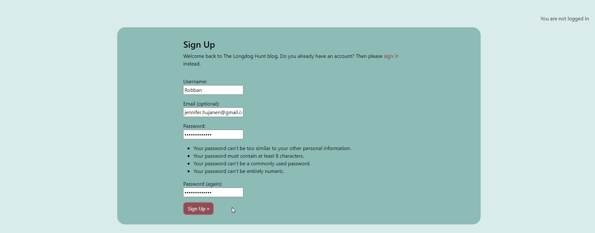
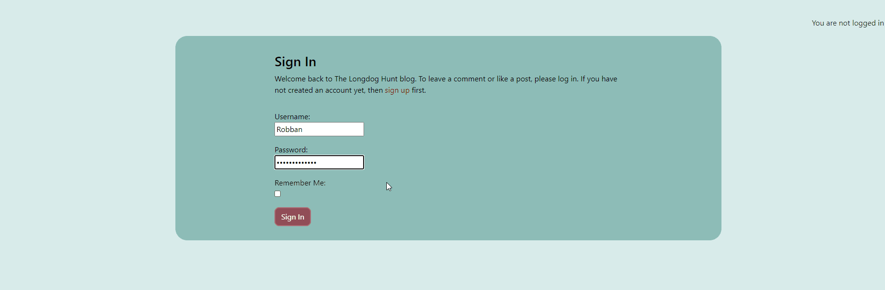
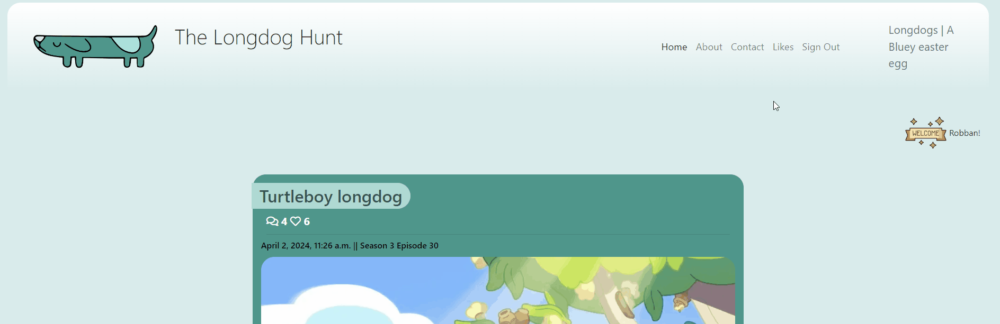
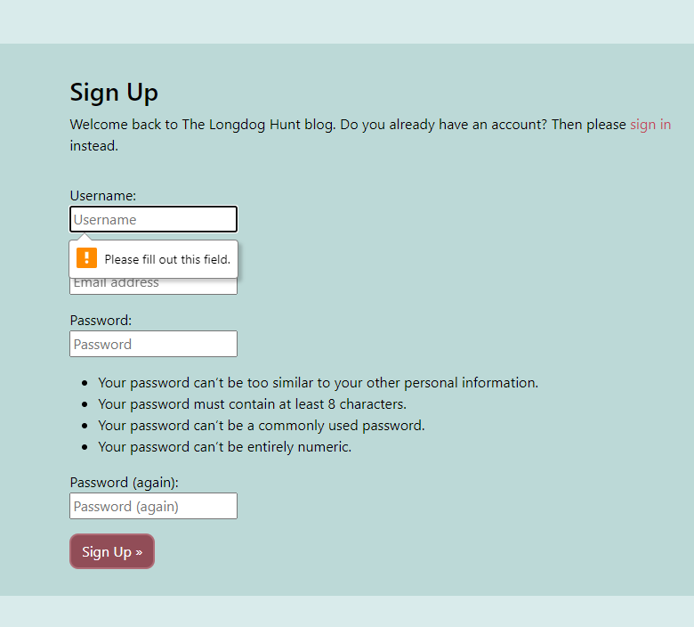
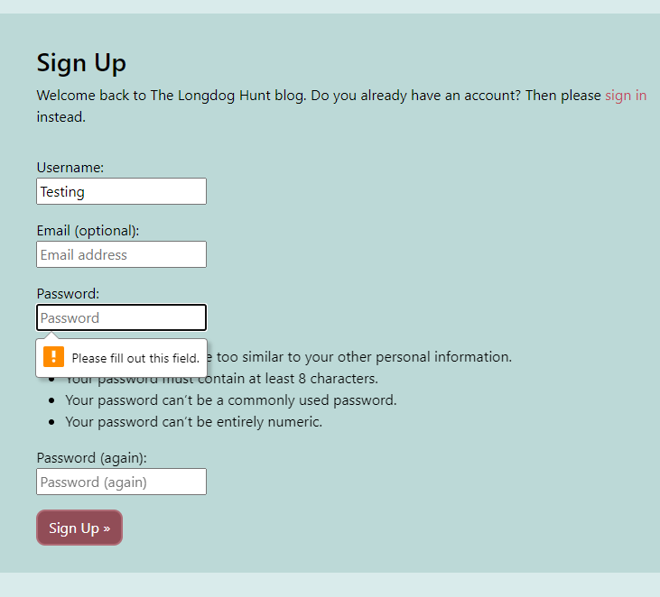
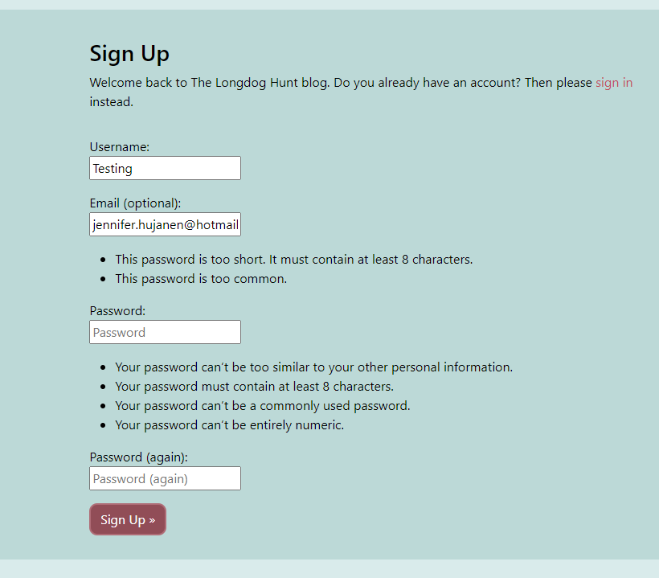
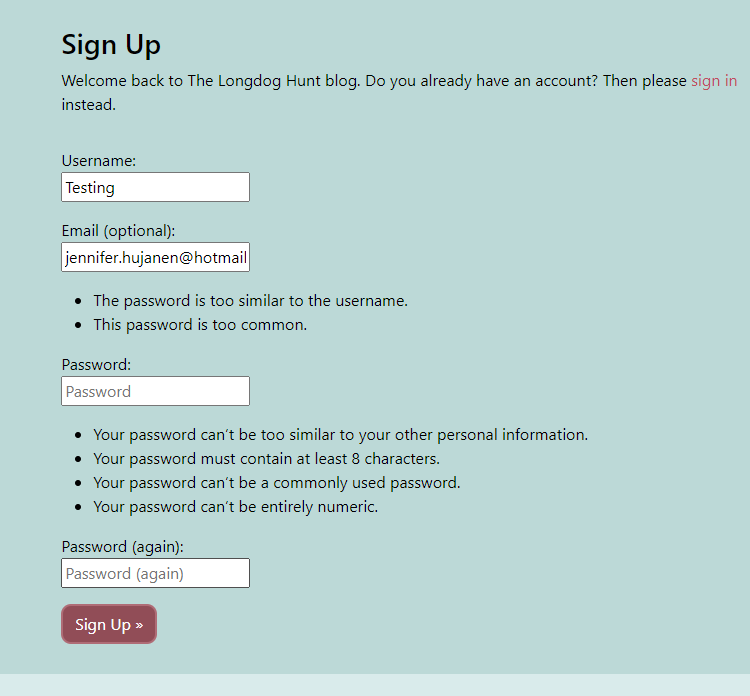
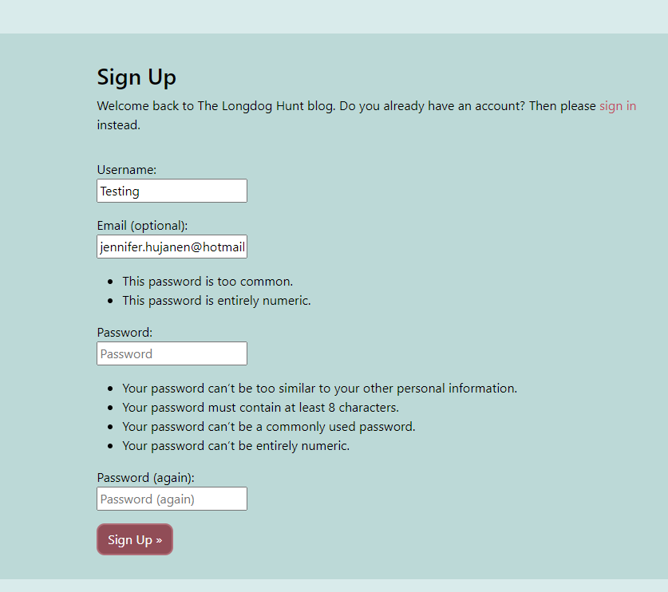
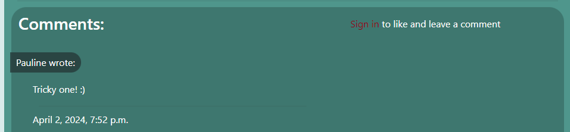
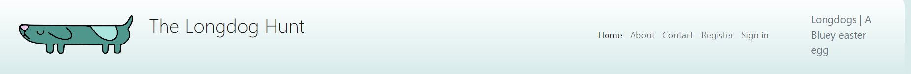

## Manual Functional Testing

<b>Navigation</b>

 

<b>Navigation Links</b>

Testing was performed to ensure all navigation links on the respective pages, navigated to the correct pages as per design. This was done by clicking on the navigation links on each page.

- Home -> index.html
- About -> about.html
- Contact -> contact.html
- Likes -> liked_posts.html
- Logout -> Sign out all auth page
- Login -> Sign in all auth page
- Register -> Sign up all auth page

- Clicking on blogposts in index.html -> post_detail.html
- Link to login on register -> Sign up all auth page
- Link to login on post_detail.html -> Sign in all auth page
- Link to sign up all auth page on login page -> Sign up all auth page

All navigation links directed to the correct pages as expected.

<b>Contactform</b>

Description:

Make sure a user can send a message with the contact form

Steps:

1. Navigate to the contact page
2. Fill in the fields
3. Press send, the user should get a confirmation message

Expected:

Menu has been updated and a toast message displayed to the user it was updated

Actual: 

Menu has been updated and a toast message displayed to the user it was updated

<b>Authentication</b>

 
Description:

Ensure a user can register to the website

Steps:

1. Navigate to [The longdog Hunt](https://the-longdog-hunt-9f116eb214b4.herokuapp.com/accounts/signup/) and click Register
2. Enter email, username and password 
3. Click Sign up

Expected:

If a user has entered everything correctly they should be logged in upon clicking on sign up.

Actual: 

The users is logged in upon clicking on sign up.

Description:

Ensure a user can log in once signed up

Steps:
1. Navigate to [The Longdog Hunt login](https://the-longdog-hunt-9f116eb214b4.herokuapp.com/accounts/login/)
2. Enter login details created in previous test case
3. Click login

Expected:

User is successfully logged in and redirected to the home page

Actual:

User is successfully logged in and redirected to the home page

Description:

Ensure a user can sign out

Steps:

1. Login to the website
2. Click the logout button
3. Click confirm on the confirm logout page

Expected:

User is logged out

Actual:

User is logged out

Description:

Ensure the user is required to enter username and correct password according to the requirements

Steps:

1. Navigate to [Signup](https://the-longdog-hunt-9f116eb214b4.herokuapp.com/accounts/signup/)
2. Enter details but skip the username
3. Click sign up

Expected:

The user is prompted to fill out the username field. If user does not fill the name out a message should appear prompting the user to fill out that field.

Actual:

The username field displays a message telling the user to fill out the missing field.

No password:

1. Navigate to [Signup](https://the-longdog-hunt-9f116eb214b4.herokuapp.com/accounts/signup/)
2. Enter details but skip the password
3. Click sign up

Expected:

##The user is prompted to fill out the password field

Actual:

An alert message appears and is prompting the user to fill out the password field

Wrong password:

1. Navigate to [Signup](https://the-longdog-hunt-9f116eb214b4.herokuapp.com/accounts/signup/)
2. Enter details but enter a password that is not correct
3. Click sign up

Expected:

The user is prompted to fill out the correct password according to the requirements.

Actual:

An alert message appears and is prompting the user to fill out the password the correct way

<b>Authenticated user functions</b>

Description:

Ensure user can successfully delete a comment.

Steps:
1. Login as a user with a booking or create a new booking
2. Click the Manage Booking nav link
3. Click the delete button on a booking
4. Click the confirm button on the delete page

Expected:

Booking is successfully deleted

Actual:

Booking is successfully deleted

Description:

Ensure a menu can be deleted

Steps:

1. Navigate to the manage menus page from the menus drop down nav link
2. Click the delete button on a menu
3. On the delete confirmation page click confirm

Expected:

Menu has been deleted and cannot be seen on the menus page

Actual:

Menu has been deleted and cannot be seen on the menus page

<b>Non authenticated user</b>

Description:
Ensure that a user that isn't authenticated can't comment or like blogposts

steps:
1. Navigate to a blogpost without signing in.
2. Scroll down to comments.
3. A message next to the comments should be displayed telling the user they need to be logged in to comment or like.
4. When clicking on the like button above the comments nothing should happen.

Expected:

The commentfield should not be displayed for a non authenticated user and a message should tell them to sign in to comment or like and a link to the login page should be provided.

Actual:

The commenfield is not displayed and the message is showing with a link to the login page.

Expected:

Clicking on the like button as a non authenticated user will do nothing to the like button. 

Actual:

The like button is disabled and the non authenticated user can't click on the like button.

Expected:

As a user that isn't authenticated the navbar should display Home, About, Contact, Register and Sign in.

Actual:

The navbar displays the exptected links.

<b>Confirmation</b>

 

<b>Confirmation messages</b>

Confirmation messages are prompted whenever the user makes any type of change: create something that is posted, delete something, send something, like or unlike a post, make edit, sign out, sign in or sign up.
These have all been tested and are prompted as they should:

**Footer**

Testing was performed on the footer links by clicking the font awesome icons and ensuring that the facebook icon opened facebook in a new tab and the github icon opened the github respitory in another tab. These behaved as expected.

## Code Validation
__HTML & CSS__

All html and css files ran through the [Official W3C validator](https://validator.w3.org/)

___CSS___: All files valid

___HTML___: All html passed except for the blogpost page and signup page. 
Errors displayed below are errors caused by Allauth and by Summernote and is nothing I can do anythin about considering the errors are caused by code from other packages and not my direct code.
Errors ignored since they are not caused by my code and make no impact on the functionality but might impact functionality and the visual aspects if resolved.

__Python__

All files ran through Code Institutes [Python Linter](https://pep8ci.herokuapp.com/#)

Every .py file has passed without any issues or errors.

__JavaScript__

All files run through the [JSHint Linter](https://jshint.com/)

Javascript file passed without any issues or errors.

__Lighthouse__

All pages were analyzed by Lighthouse: [See reports]()

## Bugs

| Screenshot | Notes |
| --- | --- |
|  |  Three lines of code in option-picking the riddles was given the "line too long" warning in the validator. I tried everything to break the lines in two and make it work and everything came back giving errors in either the terminal or in the validator. The only thing that actually worked without errors was a backward slash but instead this created a big gap between the line telling the user to pick an answer and the "(1-4)". I decided to edit the printed text to make it short enough to be on the same line to make it work and look the best it could without awkward gaps. |

---