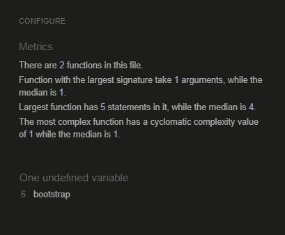

## Manual Functional Testing

<b>Navigation</b>

 

<b>Navigation Links</b>

Testing was performed to ensure all navigation links on the respective pages, navigated to the correct pages as per design. This was done by clicking on the navigation links on each page.

- Home -> index.html

- About -> about.html

- Contact -> contact.html

- Likes -> liked_posts.html

- Logout -> Sign out all auth page

- Login -> Sign in all auth page

- Register -> Sign up all auth page

- Clicking on blogposts in index.html -> post_detail.html

- Link to login on register -> Sign up all auth page
- Link to login on post_detail.html -> Sign in all auth page
- Link to sign up all auth page on login page -> Sign up all auth page

- Navigation menu will scale down to a hamburger menu when screen size gets smaller and the longdog dog icon will be hidden to save space on page. Instead a longdog icon is hidden at the top of the collapsed menu.

All navigation links directed to the correct pages as expected.

<b>Contactform</b>

 

- The contactform can be used no matter if the user is authenticated or not and will give the same results regarding required fields and prompted messages.

Description:

Make sure a user can send a message with the contact form

Steps:

1. Navigate to the contact page
2. Fill in the fields
3. Press send, the user should get a confirmation message

Expected:

The user should get a message confirming the message is sent.

Actual: 

The confirming message is displayed when user clicks on submit.

Description:

Make sure a user fills in the form correctly before sending message.

Steps:

1. Navigate to the contact page
2. Do not add any information.
3. Press send, the user should get a message telling them to fill in the name field.
4. Add only a name.
5. Press send, the user should get a message telling them to fill in the email field.
6. Add email but no message.
7. Press send, the user should get a message telling them to fill in the message field.
8. Add message.
9. Press send, the user should now get the confirmation message that the message is sent now that all required fields are filled in.

Expected:

The user should get a message prompting them to fill in the required field that is missing content on each field that is empty in the contact form.

Actual: 

The message is prompted on each field when the user has left them empty. 
When every required field is filled the message is sent and the user gets the confirmation message.

<b>Authentication</b>

 

Description:

Ensure a user can register to the website

Steps:

1. Navigate to [The longdog Hunt](https://the-longdog-hunt-9f116eb214b4.herokuapp.com/accounts/signup/) and click Register
2. Enter email, username and password 
3. Click Sign up

Expected:

If a user has entered everything correctly they should be logged in upon clicking on sign up.

Actual: 

The users is logged in upon clicking on sign up.

Description:

Ensure a user can log in once signed up

Steps:
1. Navigate to [The Longdog Hunt login](https://the-longdog-hunt-9f116eb214b4.herokuapp.com/accounts/login/)
2. Enter login details created in previous test case
3. Click login

Expected:

User is successfully logged in and redirected to the home page

Actual:

User is successfully logged in and redirected to the home page

Description:

Ensure a user can sign out

Steps:

1. Login to the website
2. Click the logout button
3. Click confirm on the confirm logout page

Expected:

User is logged out

Actual:

User is logged out

Description:

Ensure the user is required to enter username and correct password according to the requirements

Steps:

1. Navigate to [Signup](https://the-longdog-hunt-9f116eb214b4.herokuapp.com/accounts/signup/)
2. Enter details but skip the username
3. Click sign up

Expected:

The user is prompted to fill out the username field. If user does not fill the name out a message should appear prompting the user to fill out that field.

Actual:

The username field displays a message telling the user to fill out the missing field.

No password:

1. Navigate to [Signup](https://the-longdog-hunt-9f116eb214b4.herokuapp.com/accounts/signup/)
2. Enter details but skip the password
3. Click sign up

Expected:

The user is prompted to fill out the password field

Actual:

An alert message appears and is prompting the user to fill out the password field

Wrong password:

1. Navigate to [Signup](https://the-longdog-hunt-9f116eb214b4.herokuapp.com/accounts/signup/)
2. Enter details but enter a password that is not correct
3. Click sign up

Expected:

The user is prompted to fill out the correct password according to the requirements.

Actual:

An alert message appears and is prompting the user to fill out the password the correct way

<b>Authenticated user functions</b>

 
<b>User comment creation</b> 
Description:

Ensure user can successfully create a comment.

Steps:
1. Login as a user.
2. Click on a blogpost and scroll down to the comments field.
3. Write a comment and click post, the user should get a confirmation message.
4. The comment is now displayed with the correct "edit" and "delete" buttons.

Expected:

Comment is posted with a confirmation message and the comment is displayed straight away with correct buttons below (buttons only visible for the author of the comment)

Actual:

Comments, confirmation message and buttons are all displayed as they are supposed to without any issues.

<b>Edit and delete own comments</b> 
Description:

Ensure user can only edit and delete their own comment.

Steps:
1. Login as a user
2. Go to a post with comments you've created or create a comment.
3. Others comments should not have any buttons visible, buttons should only be displayed on the users own comment.

Expected:

The user can only edit and delete their own comments

Actual:

The edit and delete buttons are only visible to the author of said comment.

<b>User edit comment</b> 
Description:

Make sure a user can edit their comment with a confirmation message when posting their comment again.

Steps:

1. Navigate to the blogpost with users own comments on it.
2. Click the edit button on the comment.
3. The comment should now appear in the comment window to the right (or below on smaller screens) and the user can now edit the comment and click on submit.
4. Click on submit, user should now get a confirmation message and the new comment is now posted.

Expected:

Users comments can be edited when clicking Edit below the users comment. When clicking submit the confirmation message should appear and the new comment should be displayed.

Actual:

The comment can be edited, message is displayed when new comment is submitted and the new comment is visible in the commentsfield.

<b>User delete comments</b> 
Description:

Make sure the user can delete their comment.

Steps:

1. Navigate to the blogpost with users own comments on it.
2. Click the delete button on the comment.
3. A modal making sure the user wants to delete their comment should now appear.
4. After user confirms a confirmation message is displayed and comment is deleted

Expected:

User should be abled to press the delete comment, confirm in the modal that they want to delete and then get a message confirming that comment now is deleted.
The comment should now have been deleted.

Actual:

The comment is deleted as expected.

<b>User likes</b> 
Description:

Ensure user can like and dislike a post when logged in

Steps:
1. Login as a user
2. Go to a post and scroll down.
3. Click on the like button (a heart) and the user should now get a message that they liked the post and the heart should now be a solid white heart and the number should change with a +1.
4. Click on the like button again and another message should display telling the user they've unliked the post and the heart should now be hollow and the number should have changed with -1.

Expected:

The user can like and unlike a post and get a message telling them they did.
The heart should turn from hollow to solid when liked and then back again if unliked.
The number on the like button should change with a +1 if liked and -1 if unliked.

Actual:

The like button works as expected above.

<b>Liked posts page</b> 
Description:

When a user is authenticated a new page in the navbar appears, the Likes page.
The user can navigate to the Likes page to view all their liked posts. 
From here they can reach each post by clicking on them.

Steps:

1. Navigate to the Likes page in the navbar.
2. Now the list of liked posts should be displayed for the user.

Expected:

The user can view all their liked posts by navigating to the Likes page.

Actual:

The Likes page works as it should and the users liked posts are displayed.

<b>Non authenticated user</b>

 

<b>Can't comment or like</b> 

Description:
Ensure that a user that isn't authenticated can't comment or like blogposts

steps:
1. Navigate to a blogpost without signing in.
2. Scroll down to comments.
3. A message next to the comments should be displayed telling the user they need to be logged in to comment or like.
4. When clicking on the like button above the comments nothing should happen.

Expected:

The commentfield should not be displayed for a non authenticated user and a message should tell them to sign in to comment or like and a link to the login page should be provided.

Actual:

The commenfield is not displayed and the message is showing with a link to the login page.

Expected:

Clicking on the like button as a non authenticated user will do nothing to the like button. 

Actual:

The like button is disabled and the non authenticated user can't click on the like button.

Expected:

As a user that isn't authenticated the navbar should display Home, About, Contact, Register and Sign in.

Actual:

The navbar displays the exptected links.

<b>Confirmation</b>

 

<b>Confirmation messages</b>

Confirmation messages are prompted whenever the user makes any type of change: create something that is posted, delete something, send something, like or unlike a post, make edit, sign out, sign in or sign up.
These have all been tested and are prompted as they should:

<b>Admin Panel Testing</b>

The adminpanel testing was done by clicking my way trough and manually test the functions.

- Clicking on Posts -> Displays blogposts with 
- Clicking on each post -> Opens the post and enables the editing of said post
- 

**Footer**

Testing was performed on the footer links by clicking the font awesome icons and ensuring that the facebook icon opened facebook in a new tab and the github icon opened the github respitory in another tab. These behaved as expected.

## Code Validation
__HTML & CSS__

All html and css files ran through the [Official W3C validator](https://validator.w3.org/)

___CSS___: All files valid 

___HTML___: All html passed whitout any errors except for the blogpost page and signup page.

Errors displayed below are errors caused by Allauth and by Summernote and is nothing I can do anythin about considering the errors are caused by code from other packages and not my direct code.
Summernote adds styling to the HTML code on blogposts and about page that I have not added myself and this is then causing errors in the validation.
Errors ignored since they are not caused by my code and make no impact on the functionality but might impact functionality and the visual aspects if resolved.

__Python__

All files ran through Code Institutes [Python Linter](https://pep8ci.herokuapp.com/#)
Every .py file has passed without any issues or errors.

__JavaScript__

All files run through the [JSHint Linter](https://jshint.com/)
Javascript file passed without any issues or errors.

__Lighthouse__

Website was analyzed with Lighthouse: 

Performance can be improved with changing how cloudinary handles the images.
Some of the issues that had negative impact on the perfomance had to do with Heroku itself and the database, things I can't change at this moment.

## Bugs

| Screenshot | Notes |
| --- | --- |
|  |  Three lines of code in option-picking the riddles was given the "line too long" warning in the validator. I tried everything to break the lines in two and make it work and everything came back giving errors in either the terminal or in the validator. The only thing that actually worked without errors was a backward slash but instead this created a big gap between the line telling the user to pick an answer and the "(1-4)". I decided to edit the printed text to make it short enough to be on the same line to make it work and look the best it could without awkward gaps. |

---